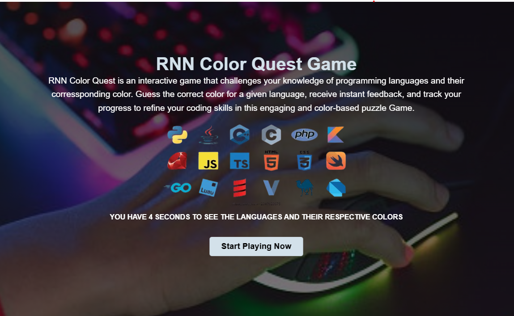

RNN Color Quest Game
RNN Color Quest is an interactive game that challenges your knowledge of programming languages and their corressponding color. Guess the correct color for a given language, receive instant feedback, and track your progress to refine your coding skills in this engaging and color-based puzzle Game.

